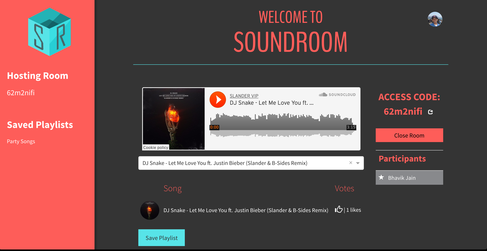

# SoundRoom

SoundRoom is a shared music platform that allows users to collaborate in creating playlists for situations like road trips or parties. The music plays on the host’s device, and additional participants can add songs, which get entered into a queue. Each song in the queue can be upvoted, and the highest voted song gets played first.

#Technical Challenges:

1) SoundRoom needs an API that provides songs for the users to play, such as the Soundcloud API. We have played around with the Soundcloud API and have decided to use it due to its ease-of-use.

2) SoundRoom needs to use real-time event based communication for adding songs, voting songs, and playback. This can be accomplished with the use of websockets, which a member of our team is familiar with.

3) SoundRoom needs an algorithm to sort the songs based on the number of votes in real-time, and then queue up the song with the highest number of upvotes. This can likely be accomplished using a built-in JavaScript library function.

#Contributors:
* Aarsh Patel
* Bhavik Jain
* Justin Martinelli
* Lynn Samson
* Sidd Patel
* Ronit Arora
